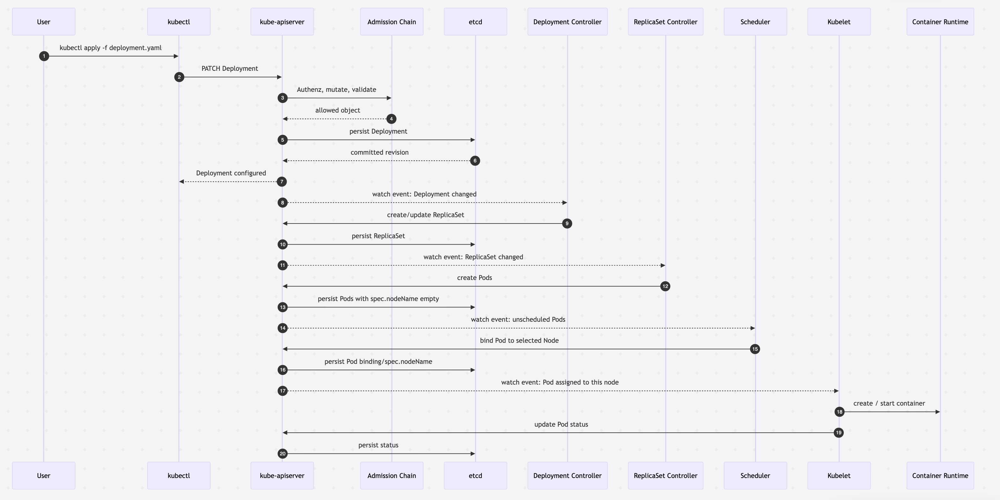
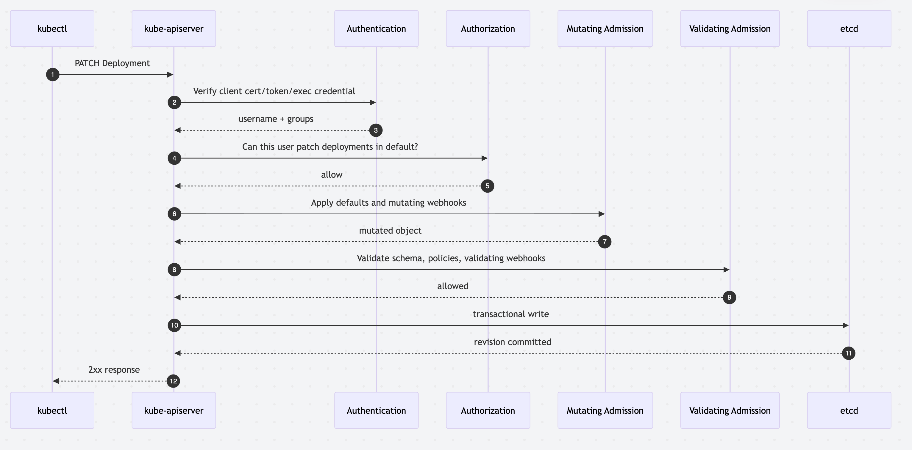
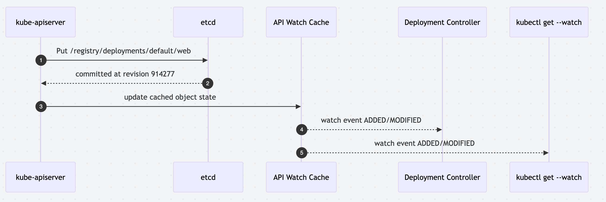
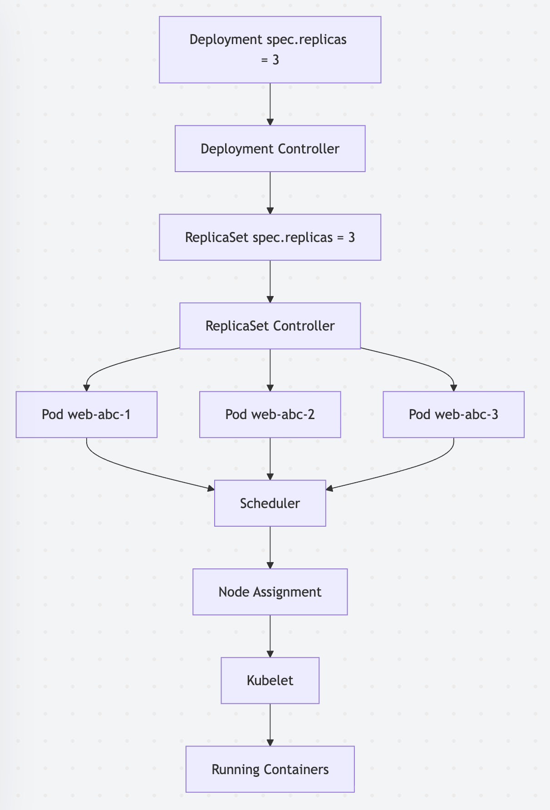
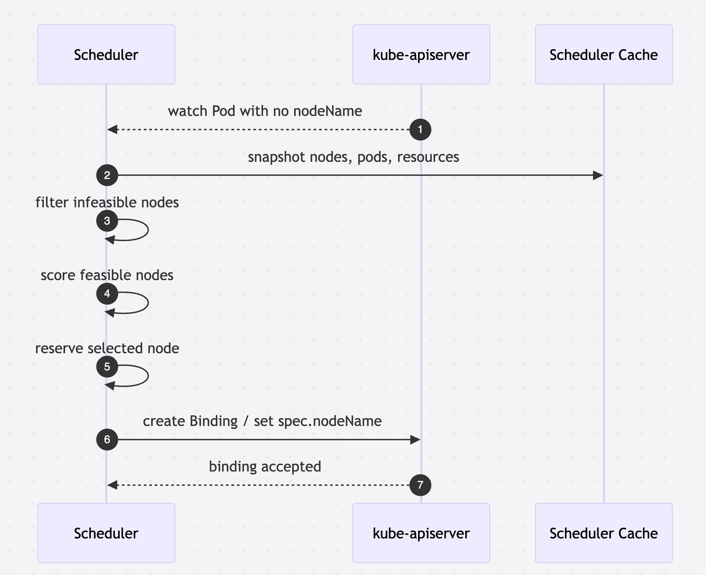
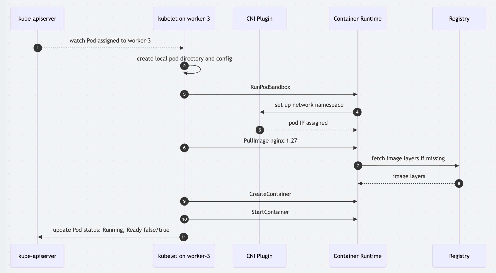

# What Actually Happens When You Type `kubectl apply`

## Kubernetes Internals, API Writes, And Reconciliation Loops

`kubectl apply` looks like a simple command:

```shell
kubectl apply -f deployment.yaml
```

But that command does not "start a pod" in the way a local process manager
starts a process.

It sends an intent to the Kubernetes API.
The control plane stores that intent, then a collection of independent
reconciliation loops gradually turns the desired state into running containers.

That distinction is the core mental model:

- `kubectl` is a client.
- The API server is the front door and consistency boundary.
- Admission controllers mutate and validate the request.
- `etcd` stores the desired state.
- Controllers observe state and create more state.
- The scheduler binds unscheduled pods to nodes.
- The kubelet observes assigned pods and asks the container runtime to run them.

We will trace the full path from `kubectl apply` to a running pod.
We will cover the API server, admission controllers, `etcd` writes,
reconciliation loops, scheduler decisions, kubelet actions, real API payloads,
timing analysis, and debugging techniques.

## The Short Version

Imagine this manifest:

```yaml
apiVersion: apps/v1
kind: Deployment
metadata:
  name: web
  namespace: default
  labels:
    app: web
spec:
  replicas: 3
  selector:
    matchLabels:
      app: web
  template:
    metadata:
      labels:
        app: web
    spec:
      containers:
        - name: nginx
          image: nginx:1.27
          ports:
            - containerPort: 80
          resources:
            requests:
              cpu: 100m
              memory: 128Mi
            limits:
              memory: 256Mi
```

When you run:

```shell
kubectl apply -f deployment.yaml
```

Kubernetes usually follows this path:



The important thing is that `kubectl apply` returns before most of this work is
done.
A successful apply means the API accepted and stored your desired state.
It does not mean every pod is running.

## `kubectl apply` Is A Patch Operation

`kubectl apply` is declarative in nature.
You give Kubernetes the object shape you want, and Kubernetes computes how to
merge it with the existing object.

Modern Kubernetes uses server-side apply when requested with 
[`--server-side`](https://kubernetes.io/docs/reference/using-api/server-side-apply/).

Classic client-side apply computes a patch locally and stores the last applied
configuration in an annotation.

For a Deployment, that request targets:

```text
PATCH /apis/apps/v1/namespaces/default/deployments/web
```

With server-side apply, the content type is:

```text
Content-Type: application/apply-patch+yaml
```

The object sent by the client is the desired configuration:

```yaml
apiVersion: apps/v1
kind: Deployment
metadata:
  name: web
  namespace: default
  labels:
    app: web
spec:
  replicas: 3
  selector:
    matchLabels:
      app: web
  template:
    metadata:
      labels:
        app: web
    spec:
      containers:
        - name: nginx
          image: nginx:1.27
          ports:
            - containerPort: 80
```

The API server may respond with a full object, including generated metadata:

```json
{
  "apiVersion": "apps/v1",
  "kind": "Deployment",
  "metadata": {
    "name": "web",
    "namespace": "default",
    "uid": "9b7baf1c-8f23-4df0-8c41-35547b7f46c3",
    "resourceVersion": "914277",
    "generation": 1,
    "creationTimestamp": "2026-05-23T14:11:02Z",
    "managedFields": [
      {
        "manager": "kubectl",
        "operation": "Apply",
        "apiVersion": "apps/v1",
        "fieldsType": "FieldsV1"
      }
    ]
  },
  "spec": {
    "replicas": 3,
    "selector": {
      "matchLabels": {
        "app": "web"
      }
    },
    "template": {
      "metadata": {
        "labels": {
          "app": "web"
        }
      },
      "spec": {
        "containers": [
          {
            "name": "nginx",
            "image": "nginx:1.27",
            "ports": [
              {
                "containerPort": 80,
                "protocol": "TCP"
              }
            ]
          }
        ]
      }
    },
    "strategy": {
      "type": "RollingUpdate",
      "rollingUpdate": {
        "maxUnavailable": "25%",
        "maxSurge": "25%"
      }
    }
  },
  "status": {}
}
```

You'll notice a few things that were missing from our original YAML:

- `uid` is assigned by the API server.
- `resourceVersion` is the storage version used for concurrency and watches.
- `generation` changes when the desired spec changes.
- `managedFields` tracks field ownership for server-side apply.
- Default values such as `protocol: TCP` and rollout strategy may appear even
if you did not write them.

The status is empty or stale at first because status is written later by
controllers.
The API write accepted the desired state but the system has not yet finished 
converging or "reconciling".

## Kube API Server

Every durable Kubernetes state transition goes through the API server.

The API server is responsible for many things.
Among them:

- Serving the Kubernetes REST API.
- Authenticating the caller.
- Authorizing the requested action.
- Running admission controllers.
- Validating object schemas and invariants.
- Persisting accepted objects to `etcd`.
- Serving watches to controllers, schedulers, kubelets, and clients.

For `kubectl apply`, the request path roughly looks like this:



The API server does not call the kubelet to create containers and
it also does not directly run the scheduler loop for your object.
The API server persists state to `etcd` and publishes that state 
through watches.

That architecture is one of the reasons why Kubernetes scales 
so well operationally.
Components can crash randomly and when they come back up, they can
resume from API state
Controllers additionally do not need to share memory,
they watch objects, compare desired state with observed state, and make API
writes.

## Authentication And Authorization

Before Kubernetes evaluates your YAML, it asks two questions:

1. Who are you?
1. Are you allowed to do this?

Authentication can come from client certificates, bearer tokens, OIDC, cloud
provider plugins, or an exec credential plugin in your kubeconfig.

Authorization commonly uses RBAC.
For this command:

```shell
kubectl apply -f deployment.yaml
```

the user needs permission to create or patch Deployments in the target
namespace.
Depending on whether the object exists, the effective verb may be `create`,
`patch`, or `update`.

You can test this before applying:

```shell
kubectl auth can-i patch deployment web -n default
kubectl auth can-i create deployment -n default
kubectl auth can-i create pods -n default
```

The last command is worth noting. 
You do not need permission to create pods when
you create a Deployment.
The Deployment controller creates the ReplicaSet, and the ReplicaSet controller
creates Pods using its own service account and control-plane permissions.

That is a common source of confusion.
Your permission is checked for the object you submit.
Controller permissions are checked when controllers submit their own writes.

## Admission Controllers

Admission happens after authentication and authorization but before persistence.

Admission controllers can:

- Add defaults.
- Inject sidecars.
- Add labels and annotations.
- Enforce security policy.
- Reject invalid or risky objects.
- Call external webhooks.

There are two major phases:

1. Mutating admission can change the object.
1. Validating admission can accept or reject the final object.

For example, your original Pod template may contain one container:

```yaml
spec:
  containers:
    - name: nginx
      image: nginx:1.27
```

After mutating admission, it might contain a service mesh sidecar:

```yaml
spec:
  containers:
    - name: nginx
      image: nginx:1.27
    - name: istio-proxy
      image: docker.io/istio/proxyv2:1.24.0
      args:
        - proxy
        - sidecar
```

Or a policy webhook may reject it:

```json
{
  "kind": "Status",
  "apiVersion": "v1",
  "metadata": {},
  "status": "Failure",
  "message": "admission webhook denied the request: nginx needs cpu request",
  "reason": "Forbidden",
  "code": 403
}
```

Admission latency matters because it is on the synchronous API write path.
A slow webhook makes `kubectl apply` slow.
A broken webhook can block writes cluster-wide if its `failurePolicy` is `Fail`.

Useful commands:

```shell
kubectl get mutatingwebhookconfigurations
kubectl get validatingwebhookconfigurations
kubectl describe validatingwebhookconfiguration
kubectl get events -A --sort-by=.lastTimestamp
```

If `kubectl apply` hangs or fails before the object is created, admission is one
of the first places to look.

## `etcd` Writes

Once the API server has an allowed object, it writes the object to `etcd`.

`etcd` is the strongly consistent key-value store behind the Kubernetes API.
It stores cluster state such as:

- Deployments
- ReplicaSets
- Pods
- ConfigMaps
- Secrets
- Leases
- Nodes
- Events

A Deployment in the `default` namespace is stored under a key shaped like:

```text
/registry/deployments/default/web
```

The exact encoded value is not the pretty YAML you wrote.
The API server stores the object using Kubernetes storage encoding and tracks
versions, revisions, and metadata.

The write is the durable moment in the apply flow.
Once `etcd` commits it, watchers can observe it.



Performance of this step depends on `etcd` health:

- Disk latency on `etcd` members.
- Network latency between API servers and `etcd`.
- Leader election stability.
- Object size.
- Watch fan-out.
- API server load.

Symptoms of `etcd` or API storage trouble include:

- Slow `kubectl apply`.
- Slow object listing.
- API server logs mentioning timeout or `etcdserver: request timed out`.
- High API server request latency for write verbs.
- Controllers falling behind because watches relist frequently.

Important metrics include:

```text
apiserver_request_duration_seconds
apiserver_storage_objects
etcd_request_duration_seconds
etcd_disk_wal_fsync_duration_seconds
etcd_disk_backend_commit_duration_seconds
```

## Reconciliation Loops

Kubernetes is built out of reconciliation loops.

A reconciliation loop repeatedly asks:

1. What is the desired state?
1. What is the observed state?
1. What action moves observed state closer to desired state?

This is the main reason why the API server can return quickly,
it does not need to do all the work.
It only needs to store the desired state and then the controllers can
take over and perform that work.

For a Deployment, the chain looks like this:




Each sepcialiazed controller owns a narrow piece of
the convergence process and monitors the resources
it is responsible for.

## Deployment Controller

The Deployment controller watches Deployments and ReplicaSets.

When it sees this:

```yaml
kind: Deployment
metadata:
  name: web
spec:
  replicas: 3
  template:
    metadata:
      labels:
        app: web
    spec:
      containers:
        - name: nginx
          image: nginx:1.27
```

it creates a ReplicaSet with a pod-template hash:

```json
{
  "apiVersion": "apps/v1",
  "kind": "ReplicaSet",
  "metadata": {
    "name": "web-7c8b9d7f6d",
    "namespace": "default",
    "ownerReferences": [
      {
        "apiVersion": "apps/v1",
        "kind": "Deployment",
        "name": "web",
        "uid": "9b7baf1c-8f23-4df0-8c41-35547b7f46c3",
        "controller": true
      }
    ],
    "labels": {
      "app": "web",
      "pod-template-hash": "7c8b9d7f6d"
    }
  },
  "spec": {
    "replicas": 3,
    "selector": {
      "matchLabels": {
        "app": "web",
        "pod-template-hash": "7c8b9d7f6d"
      }
    },
    "template": {
      "metadata": {
        "labels": {
          "app": "web",
          "pod-template-hash": "7c8b9d7f6d"
        }
      },
      "spec": {
        "containers": [
          {
            "name": "nginx",
            "image": "nginx:1.27"
          }
        ]
      }
    }
  }
}
```

The `ownerReferences` field tells Kubernetes this 
ReplicaSet is controlled by the Deployment.
It also enables garbage collection when the owner is deleted.

During a rollout, the Deployment controller may keep old ReplicaSets around,
scale a new one up, and scale old ones down according to `maxSurge` and
`maxUnavailable`.

Some helpful commands:

```shell
kubectl describe deployment web
kubectl get rs -l app=web
kubectl rollout status deployment/web
kubectl rollout history deployment/web
```

## ReplicaSet Controller

The ReplicaSet controller watches ReplicaSets and Pods.

If the ReplicaSet says `replicas: 3` but only one matching Pod exists, the
controller creates two more Pods.

The Pod objects are also API writes:

```json
{
  "apiVersion": "v1",
  "kind": "Pod",
  "metadata": {
    "generateName": "web-7c8b9d7f6d-",
    "namespace": "default",
    "labels": {
      "app": "web",
      "pod-template-hash": "7c8b9d7f6d"
    },
    "ownerReferences": [
      {
        "apiVersion": "apps/v1",
        "kind": "ReplicaSet",
        "name": "web-7c8b9d7f6d",
        "uid": "53ff7a1a-82c4-4aa0-9798-975ee60c2142",
        "controller": true
      }
    ]
  },
  "spec": {
    "containers": [
      {
        "name": "nginx",
        "image": "nginx:1.27",
        "resources": {
          "requests": {
            "cpu": "100m",
            "memory": "128Mi"
          },
          "limits": {
            "memory": "256Mi"
          }
        }
      }
    ]
  }
}
```

After creation, the Pod has no node assignment yet:

```yaml
spec:
  nodeName: ""
status:
  phase: Pending
```

That empty `nodeName` tells the scheduler that it now
has work to do.

## Scheduler Decisions

The scheduler watches for Pods without `spec.nodeName`.

For each unscheduled Pod, it tries to find the best node.
Scheduling is more of a pipeline than a single check as there
are a lot of things for the scheduler to consider.

At a high level:



The scheduler considers many constraints:

- CPU and memory requests.
- Node selectors.
- Node affinity and anti-affinity.
- Taints and tolerations.
- Topology spread constraints.
- PersistentVolume topology.
- Pod affinity and anti-affinity.
- RuntimeClass.
- Ports requested with `hostPort`.

A simplified Pod binding looks like this:

```json
{
  "apiVersion": "v1",
  "kind": "Binding",
  "metadata": {
    "name": "web-7c8b9d7f6d-k2l9x",
    "namespace": "default"
  },
  "target": {
    "apiVersion": "v1",
    "kind": "Node",
    "name": "worker-3"
  }
}
```

After the binding is persisted, the Pod spec effectively contains:

```yaml
spec:
  nodeName: worker-3
```

If scheduling fails, the Pod remains `Pending` and gets events:

```text
0/5 nodes are available:
2 Insufficient cpu, 3 node(s) had untolerated taint.
preemption:
0/5 nodes are available:
2 No preemption victims found for incoming pod,
3 Preemption is not helpful for scheduling.
```

Some useful commands:

```shell
kubectl describe pod web-7c8b9d7f6d-k2l9x
kubectl get events -n default --sort-by=.lastTimestamp
kubectl get nodes
kubectl describe node worker-3
kubectl top nodes
```

Scheduler performance is usually fast, often milliseconds per simple Pod, but
complex affinity, large clusters, topology constraints, and high pending-pod
volume can increase scheduling latency.

Useful metrics:

```text
scheduler_pod_scheduling_attempts
scheduler_pod_scheduling_duration_seconds
scheduler_pending_pods
scheduler_framework_extension_point_duration_seconds
```

## Kubelet Actions

The kubelet runs on each node.
It is responsible for watching the API server 
for Pods assigned to its node.
Once the scheduler binds a Pod to `worker-3`, only the kubelet on `worker-3`
acts on it.



The kubelet does a lot:

- Creates the pod sandbox.
- Calls CNI to configure networking.
- Pulls images through the container runtime.
- Creates containers.
- Mounts volumes.
- Applies resource settings through cgroups.
- Runs startup, readiness, and liveness probes.
- Reports Pod and container status.

The kubelet does not write the Pod spec but instead
writes status through the API server.
That is why `kubectl get pod -o yaml` has two major halves:

```yaml
spec:
  nodeName: worker-3
  containers:
    - name: nginx
      image: nginx:1.27
status:
  phase: Running
  podIP: 10.42.3.19
  conditions:
    - type: PodScheduled
      status: "True"
    - type: Initialized
      status: "True"
    - type: Ready
      status: "True"
    - type: ContainersReady
      status: "True"
  containerStatuses:
    - name: nginx
      ready: true
      restartCount: 0
      image: nginx:1.27
      containerID: containerd://5c7d4f...
```

If the Pod is stuck after scheduling, the problem is often on the node:

- Image pull failure.
- CNI failure.
- Volume mount failure.
- Container crash.
- Probe failure.
- Resource pressure.
- Runtime issue.

Some useful commands:

```shell
kubectl describe pod web-7c8b9d7f6d-k2l9x
kubectl logs web-7c8b9d7f6d-k2l9x
kubectl logs web-7c8b9d7f6d-k2l9x --previous
POD=web-7c8b9d7f6d-k2l9x
kubectl get pod "$POD" \
  -o jsonpath='{.status.containerStatuses[*].state}'
kubectl describe node worker-3
```

On the node, if you have access:

```shell
journalctl -u kubelet
crictl ps -a
crictl logs <container-id>
crictl inspectp <pod-sandbox-id>
```

## Timing And Performance Analysis

The total time from `kubectl apply` to Ready depends on multiple independent
latencies.

For a normal Deployment with a warm image and healthy control plane, a rough
timeline might look like:

```text
0-100 ms      kubectl builds request, talks to API server
5-250 ms      authentication, authorization, admission, validation
5-100 ms      etcd write commits
10-500 ms     Deployment controller observes Deployment and creates ReplicaSet
10-500 ms     ReplicaSet controller creates Pods
10-1000 ms    scheduler assigns Pods to nodes
100 ms-5 s    kubelet observes assigned Pod and starts work
0-60 s+       image pull, volume mount, CNI, container start, probes
```

These ranges are intentionally vague as timing will vary on different
clusters and cluster types.
The slowest part of pod creation is often not the control plane, 
it's usually something upstream.

The slowness could be:
  - image pulling large images
  - dynamic volume attachment with CSIs
  - init containers
  - etc.

## Helpful Debugging Tips

When someone says "`kubectl apply` worked but my app is not up", we can
follow the path step-by-step.

### 1. Did The API Accept The Object?

```shell
kubectl get deployment web -o yaml
kubectl describe deployment web
```

If the object does not exist, the request failed before persistence.
Check authentication, authorization, admission, schema validation, namespace,
and the exact context:

```shell
kubectl config current-context
kubectl auth can-i patch deployment web -n default
kubectl apply -f deployment.yaml --dry-run=server
```

`--dry-run=server` is especially useful because it sends the object through the
API server and admission chain without persisting it.

### 2. Did The Deployment Create A ReplicaSet?

```shell
kubectl get rs -l app=web
kubectl describe deployment web
```

If no ReplicaSet appears, inspect Deployment events and controller-manager
health.

### 3. Did The ReplicaSet Create Pods?

```shell
kubectl get pods -l app=web
kubectl describe rs -l app=web
```

If the ReplicaSet has errors, events usually explain why.
Quota, limit ranges, or admission policies can reject Pods even if the
Deployment itself was accepted.

### 4. Were The Pods Scheduled?

```shell
kubectl get pods -l app=web -o wide
kubectl describe pod <pod>
```

If `NODE` is empty, this is a scheduler problem and we should
check the scheduler health and events:

```shell
kubectl logs -n kube-system kube-scheduler
kubectl get events
```

### 5. Did The Kubelet Start The Containers?

```shell
kubectl describe pod <pod>
kubectl logs <pod>
kubectl logs <pod> --previous
```

If `NODE` is set but the container is not Ready, this is usually a node,
runtime, image, volume, probe, or application problem.

## Watching The Workflow Live

A good way to build intuition is to watch each object type in separate
terminals.

Terminal 1:

```shell
kubectl get deployment web -w
```

Terminal 2:

```shell
kubectl get rs -l app=web -w
```

Terminal 3:

```shell
kubectl get pods -l app=web -w -o wide
```

Terminal 4:

```shell
kubectl get events -n default --sort-by=.lastTimestamp -w
```

Then apply:

```shell
kubectl apply -f deployment.yaml
```

You will see the object graph appear in order:

```text
deployment.apps/web configured
replicaset.apps/web-7c8b9d7f6d created
pod/web-7c8b9d7f6d-k2l9x created
pod/web-7c8b9d7f6d-k2l9x scheduled
pod/web-7c8b9d7f6d-k2l9x pulled
pod/web-7c8b9d7f6d-k2l9x started
```

Events are not a perfect audit log, but they are one of the fastest ways to
understand where convergence stopped and the chain of events that took place.

## Conclusion

In conclusion, a lot of things happen when you do a `kubectl apply`.

Our request has to:

- go to the API Server
- make it through authz
- get past admission controllers
- persist into `etcd`
- be reconciled by controllers
- scheduler by a scheduler
- deployed by a kubelet

before finally being a reachable pod.
It's all surprisingly quick from the client's
perspective, which is one of the reasons why
we love K8s!

Thanks for following along.
If you found this helpful or informative, please clap or leave comments!