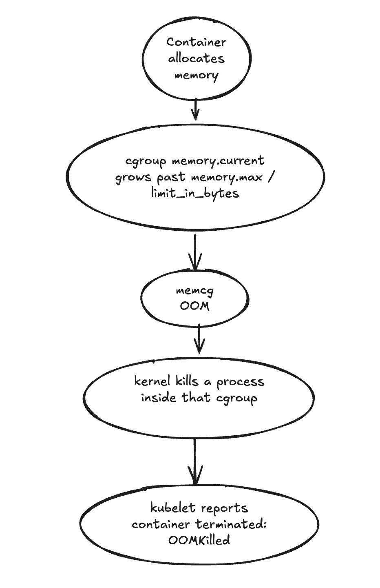
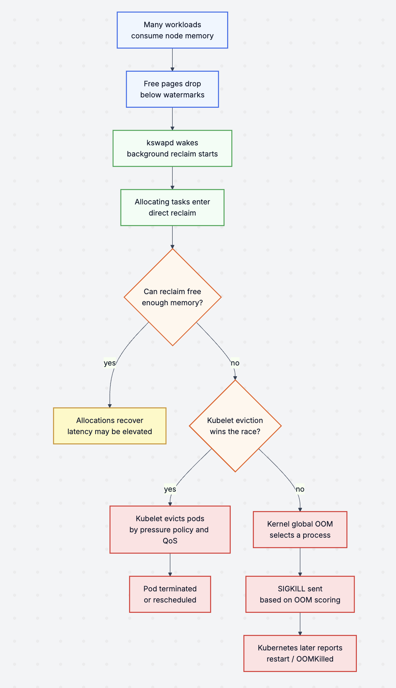
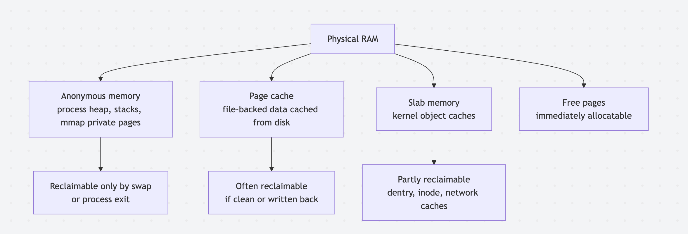
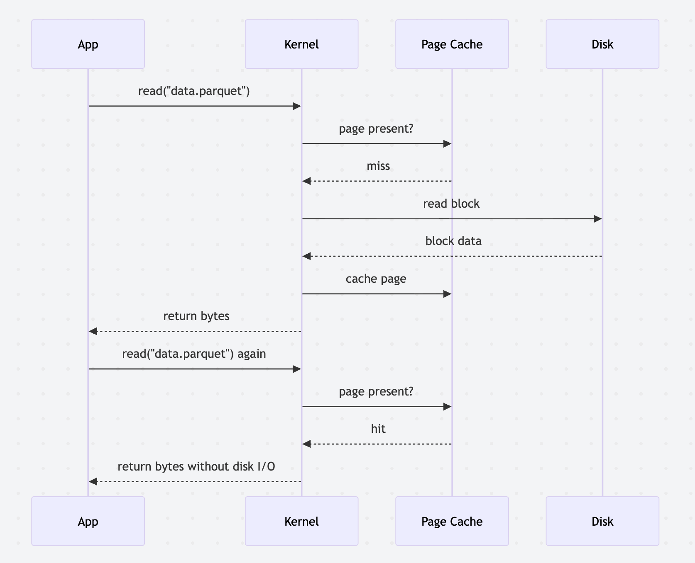
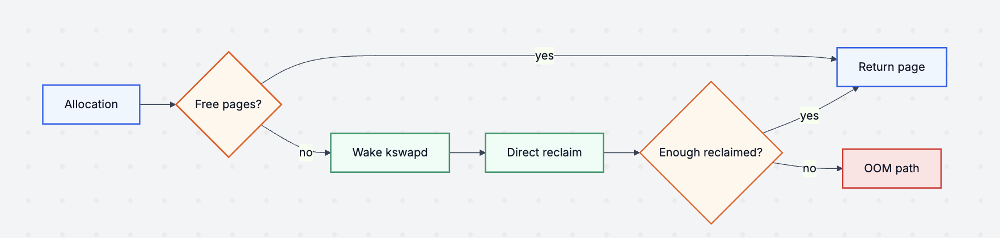
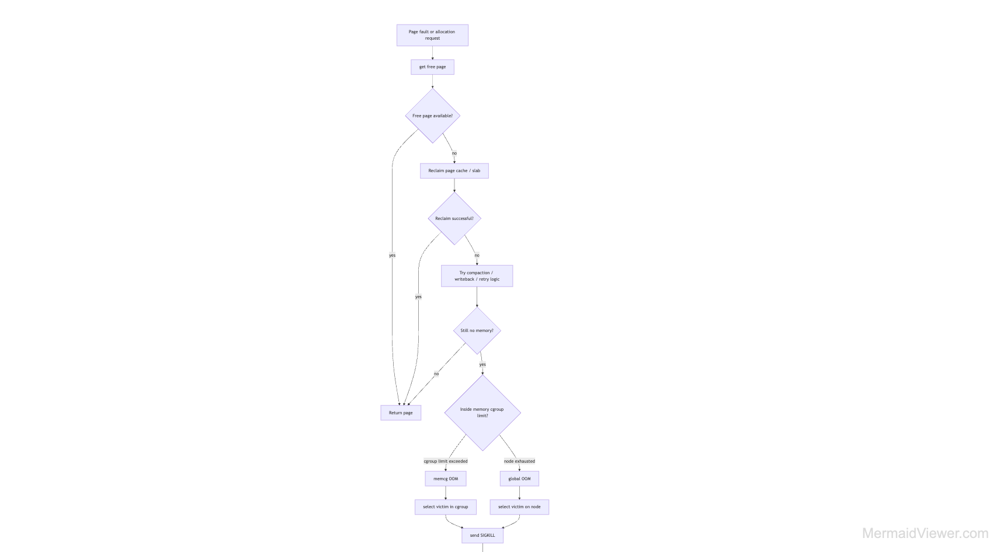
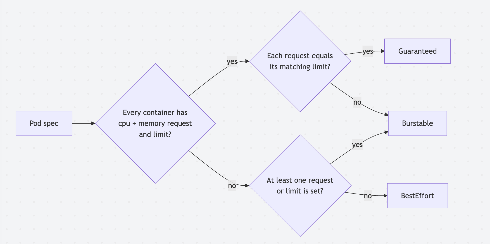
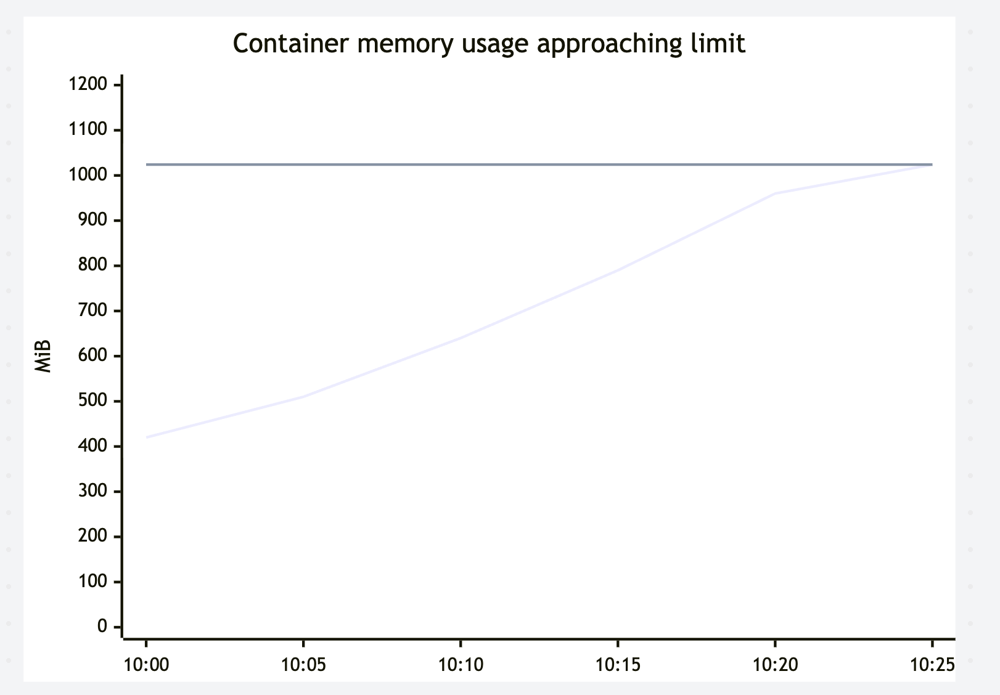

# Why Pods Can Randomly "Die"

## Linux OOM + Exit Code 137

Kubernetes does not randomly kill pods.

It can feel random because the signal is usually buried several layers below
the object you are looking at:

- The Linux kernel manages physical memory using pages, zones, watermarks,
  reclaim, and per-cgroup accounting.
- The kubelet translates pod resource requests and limits into cgroup
  controls and process `oom_score_adj` values.
- The kernel decides whether an allocation can wait, reclaim memory, wake
  `kswapd`, enter direct reclaim, or trigger the OOM killer.
- Kubernetes reports the result later as `OOMKilled`, often without the
  original pressure path that led there.

This post walks through that stack from the kernel upward. We will cover Linux
memory management, anonymous memory, page cache, slab memory, direct reclaim,
`kswapd`, OOM scoring, cgroups, Kubernetes QoS, production debugging, and ways
to keep OOMs from becoming recurring incidents.

## The Mental Model

A Kubernetes pod dies with `Reason: OOMKilled` when one of two broad things
happens:

1. The container exceeds its own memory cgroup limit.
1. The node runs out of allocatable memory and the kernel or kubelet picks
   something to kill or evict.

Those are not the same incident.

A container-limit OOM usually looks like this:



A node-pressure incident has a wider blast radius:



In both cases, the visible Kubernetes symptom may be only:

```shell
kubectl get pod api-7fdc96f7b8-pg9vr

NAME                 READY   STATUS      RESTARTS   AGE
api-7fdc96f7b8-pg9vr 0/1     OOMKilled   3          42m
```

But the root cause lives in the memory hierarchy.

## Linux Memory Is Not Just "Used" And "Free"

When people first debug OOMs, they often run `free -m` and panic because the
`free` column is tiny.

That is usually the wrong interpretation.

Linux aggressively uses unused RAM as cache. 
A healthy server may show very
little truly free memory because the kernel is using RAM to avoid disk I/O.
The important distinction is whether memory is reclaimable quickly enough when
applications need it.

Here is a simplified view:



Some definitions:

- **Anonymous memory** is usually application-owned memory. Things like the JVM heap,
  Go heap, Python objects, malloc arenas, thread stacks, and private anonymous
  mappings. Without swap, the kernel usually cannot reclaim it unless the
  process exits.
- **Page cache** is file data cached in RAM. Clean page cache is easy to drop.
  Dirty page cache must be written back first.
- **Slab memory** is kernel memory used for internal objects such as dentries,
  inodes, socket buffers, and filesystem metadata. Some slab is reclaimable,
  some is not.
- **Free memory** is memory that can be handed out immediately.

The useful command is not just `free`. I like to start with:

```shell
free -h
cat /proc/meminfo
grep -E 'MemAvailable|MemFree|Buffers|Cached|SReclaimable|SUnreclaim|Slab|AnonPages|Dirty|Writeback' /proc/meminfo
```

On a node, `MemAvailable` is a better first-glance signal than `MemFree`
because it estimates how much memory can be allocated without swapping or
major reclaim pain.

Example:

```text
MemTotal:       32768000 kB
MemFree:          612000 kB
MemAvailable:   9820000 kB
Cached:          7400000 kB
Slab:            1300000 kB
SReclaimable:     860000 kB
SUnreclaim:       440000 kB
AnonPages:      18400000 kB
Dirty:             12000 kB
Writeback:             0 kB
```

This node has low `MemFree`, but almost 9.8 GiB available. 
That is not an OOM by itself.

## Anonymous Memory

Anonymous memory is memory that is not backed by a normal file.

Applications create it constantly:

```c
char *buf = malloc(1024 * 1024 * 1024);
memset(buf, 1, 1024 * 1024 * 1024);
```

The `malloc` reserves virtual address space. 
The `memset` touches pages and causes physical memory to be committed.

For Kubernetes workloads, anonymous memory is often the memory that matters
most for OOMs:

- JVM heap and metaspace
- Go heap and goroutine stacks
- Node.js V8 heap
- Python object memory and native extension allocations
- Rust, C, and C++ allocator arenas
- In-memory caches
- Request buffers
- Decompression buffers
- Model weights loaded into process memory

You can inspect a process:

```shell
PID=1234
grep -E 'VmRSS|RssAnon|RssFile|RssShmem|VmSwap|Threads' /proc/$PID/status
cat /proc/$PID/smaps_rollup
```

Example:

```text
VmRSS:     1536000 kB
RssAnon:   1420000 kB
RssFile:     90000 kB
RssShmem:    26000 kB
VmSwap:          0 kB
```

This process is mostly anonymous RSS. 
If it keeps growing inside a cgroup
memory limit, page cache reclaim will not save it.

## Page Cache

The page cache is why the second read from disk is often much faster than the
first.



Page cache is charged to memory cgroups in Kubernetes nodes. 
That surprises teams running file-heavy workloads. 
A container can OOM not because
its heap grew, but because it read or wrote enough file-backed data charged to
its cgroup.

Inside a container using cgroup v2:

```shell
cat /sys/fs/cgroup/memory.current
cat /sys/fs/cgroup/memory.max
cat /sys/fs/cgroup/memory.stat
```

Look for:

```text
anon 734003200
file 1207959552
kernel 67108864
slab 41943040
file_dirty 0
file_writeback 0
pgscan 184912
pgsteal 173004
```

If `file` is large, the workload is consuming page cache. 
If the cgroup is at its limit, the kernel may reclaim clean 
file pages before killing anything. 
If that cache is dirty or the workload keeps faulting 
pages back in, the pod could be OOM-ed.

On cgroup v1 nodes, the files look different:

```shell
cat /sys/fs/cgroup/memory/memory.usage_in_bytes
cat /sys/fs/cgroup/memory/memory.limit_in_bytes
cat /sys/fs/cgroup/memory/memory.stat
```

## Slab Memory

Slab memory is kernel memory used to store kernel objects.

For example:

- `dentry`: directory entry cache
- `inode_cache`: inode objects
- `kmalloc-*`: general kernel allocation caches
- socket and networking structures
- filesystem metadata
- conntrack entries

Inspect it:

```shell
grep -E 'Slab|SReclaimable|SUnreclaim' /proc/meminfo
slabtop -o
```

Example:

```text
Slab:            4128768 kB
SReclaimable:    3120448 kB
SUnreclaim:      1008320 kB
```

High `SReclaimable` can be fine. 
High and growing `SUnreclaim` is more
dangerous because the kernel cannot easily shrink it.

A production incident could be:


- symptom: node memory pressure, but application RSS looks normal
- finding: `/proc/meminfo` shows `SUnreclaim` growing rapidly. `slabtop` shows `nf_conntrack` or socket-related slabs at the top
- cause: connection churn plus oversized conntrack table
- fix: reduce connection churn, tune conntrack, fix client retry storm, and set realistic node-level memory reservations

## Watermarks, kswapd, And Direct Reclaim

Linux keeps memory zones above watermarks. 
When free pages fall too low, the
kernel starts reclaim.

```text
higher memory
+------------------------------+
| plenty of free pages         |
+------------------------------+
| high watermark               |
+------------------------------+
| background reclaim wakes     |
| kswapd tries to restore free |
+------------------------------+
| low watermark                |
+------------------------------+
| allocations may enter direct |
| reclaim and block            |
+------------------------------+
| min watermark                |
+------------------------------+
| severe pressure, OOM possible |
+------------------------------+
lower memory
```

`kswapd` is a kernel thread that performs background reclaim. 
It wakes when memory falls below a watermark and tries to 
free pages before application allocations suffer.

Direct reclaim happens when a process tries to allocate memory and the kernel
cannot satisfy the allocation quickly. 
The allocating process itself does reclaim work.

That is why memory pressure can show up as latency before OOMs.



Useful node signals:

```shell
grep -E 'pgscan|pgsteal|allocstall|kswapd|compact|oom' /proc/vmstat
cat /proc/pressure/memory
```

Example:

```text
some avg10=24.65 avg60=18.20 avg300=4.91 total=982342991
full avg10=7.40 avg60=3.31 avg300=0.80 total=19003322
```

`memory.pressure` comes from PSI, Pressure Stall Information. `some` means at
least one task is stalled on memory. 
`full` means all non-idle tasks are stalled. 

## The OOM Killer Is A Last Resort

The kernel does not usually jump straight to killing processes.

The broad call flow is:



Kernel names vary by version and path, but when reading stack traces or source
you will often see functions around:

```text
__alloc_pages_slowpath()
  -> try_to_free_pages()
  -> out_of_memory()
  -> select_bad_process()
  -> oom_kill_process()

mem_cgroup_oom()
  -> out_of_memory()
  -> oom_kill_process()
```

In production, you usually infer this path from logs:

```shell
journalctl -k --since "1 hour ago" | grep -i -E 'out of memory|oom|killed process'
dmesg -T | grep -i -E 'out of memory|oom|killed process'
```

Example kernel log:

```text
Memory cgroup out of memory: Killed process 12002 (java)
total-vm:5098420kB, anon-rss:1834200kB, file-rss:41200kB,
shmem-rss:0kB, UID:1000 pgtables:9216kB oom_score_adj:997
```

Key details:

- `Memory cgroup out of memory` means this was a cgroup-limit OOM.
- `anon-rss` tells you how much anonymous resident memory the victim had.
- `file-rss` tells you file-backed resident memory.
- `oom_score_adj` tells you how Kubernetes biased the process.

## OOM Scoring

When the global OOM killer needs a victim, it computes a badness score. You can
inspect the current score for a process:

```shell
PID=1234
cat /proc/$PID/oom_score
cat /proc/$PID/oom_score_adj
```

`oom_score` is the kernel's current score. Higher is more killable.
`oom_score_adj` is an adjustment from `-1000` to `1000`.

- `-1000` means effectively never kill this task via OOM selection.
- `0` means no adjustment.
- `1000` makes the task extremely attractive as a victim.

Kubernetes sets `oom_score_adj` based on pod QoS and memory requests.

According to Kubernetes node-pressure eviction behavior:

| QoS class | `oom_score_adj` behavior |
| --- | --- |
| `Guaranteed` | `-997` |
| `BestEffort` | `1000` |
| `Burstable` | `min(max(2, 1000 - (1000 * memoryRequestBytes) / machineMemoryCapacityBytes), 999)` |

This matters during node-level memory pressure. It does not let a container
ignore its own memory limit. A `Guaranteed` pod with a 512 MiB memory limit can
still be killed if it uses more than 512 MiB.

## Kubernetes QoS Classes

Kubernetes assigns one of three QoS classes:



### Guaranteed

```yaml
apiVersion: v1
kind: Pod
metadata:
  name: api-guaranteed
spec:
  containers:
    - name: api
      image: ghcr.io/example/api:latest
      resources:
        requests:
          cpu: "500m"
          memory: "512Mi"
        limits:
          cpu: "500m"
          memory: "512Mi"
```

This pod gets `Guaranteed` QoS because every container has CPU and memory
requests and limits, and each request equals its limit.

### Burstable

```yaml
apiVersion: v1
kind: Pod
metadata:
  name: api-burstable
spec:
  containers:
    - name: api
      image: ghcr.io/example/api:latest
      resources:
        requests:
          cpu: "250m"
          memory: "512Mi"
        limits:
          cpu: "1"
          memory: "1Gi"
```

This pod gets `Burstable` QoS. It has a guaranteed reservation, but it is
allowed to use more memory until it reaches its limit or the node comes under
pressure.

### BestEffort

```yaml
apiVersion: v1
kind: Pod
metadata:
  name: debug-besteffort
spec:
  containers:
    - name: shell
      image: busybox:1.36
      command: ["sleep", "3600"]
```

This pod has no requests or limits, so it gets `BestEffort` QoS. Under node
memory pressure, it is first in line for eviction and has `oom_score_adj=1000`.

Check QoS:

```shell
kubectl get pod api-burstable -o jsonpath='{.status.qosClass}{"\n"}'
kubectl describe pod api-burstable | grep -i 'QoS Class'
```

## Why Pods Die "Randomly"

The randomness usually comes from one of these gaps:

1. The pod was killed by its cgroup, not evicted by Kubernetes.
1. The pod's page cache was charged to the cgroup, not just heap.
1. A sidecar used the memory, but the app container got blamed in dashboards.
1. Node pressure made `BestEffort` or low-request `Burstable` pods attractive
   victims.
1. A rollout changed memory shape: more workers, larger buffers, or higher
   concurrency.
1. CPU throttling slowed GC or request completion, allowing memory to build.
1. The workload had no limit in dev but a tight limit in production.
1. The service recovered quickly, so only the restart count was noticed.

The debugging trick is to determine which layer made the decision.

## Debugging Walkthrough

Start with the pod:

```shell
kubectl get pod -n payments
kubectl describe pod -n payments payments-api-7fdc96f7b8-pg9vr
kubectl get pod -n payments payments-api-7fdc96f7b8-pg9vr -o yaml
```

Look for:

```text
Last State:     Terminated
  Reason:       OOMKilled
  Exit Code:    137
  Started:      Sun, 17 May 2026 14:01:10 -0400
  Finished:     Sun, 17 May 2026 14:08:41 -0400
Restart Count:  3
```

Exit code `137` means the process died from `SIGKILL`. For containers, that
often means OOM, but confirm with the `Reason`.

Get previous logs:

```shell
kubectl logs -n payments payments-api-7fdc96f7b8-pg9vr --previous
```

Check events:

```shell
kubectl get events -n payments --sort-by='.lastTimestamp' | tail -50
```

Check node placement:

```shell
kubectl get pod -n payments payments-api-7fdc96f7b8-pg9vr -o wide
kubectl describe node ip-10-42-18-203
```

Look for node pressure:

```text
Conditions:
  Type             Status
  MemoryPressure   True
```

If `MemoryPressure=True`, widen the investigation to the node. If not, suspect
a container memory limit OOM first.

## Debugging Inside The Container Cgroup

Use an ephemeral debug container if the pod is still running:

```shell
kubectl debug -n payments -it payments-api-7fdc96f7b8-pg9vr \
  --image=busybox:1.36 \
  --target=api \
  -- sh
```

Inside the container:

```shell
cat /proc/self/cgroup
cat /sys/fs/cgroup/memory.current 2>/dev/null || true
cat /sys/fs/cgroup/memory.max 2>/dev/null || true
cat /sys/fs/cgroup/memory.events 2>/dev/null || true
cat /sys/fs/cgroup/memory.stat 2>/dev/null || true
```

cgroup v2 `memory.events` is especially useful:

```text
low 0
high 183
max 47
oom 3
oom_kill 3
```

Interpretation:

- `high`: the cgroup crossed `memory.high`, throttling/reclaim may have
  happened.
- `max`: the cgroup hit `memory.max`.
- `oom`: allocation hit OOM in the cgroup.
- `oom_kill`: the kernel killed a task in the cgroup.

For cgroup v1:

```shell
cat /sys/fs/cgroup/memory/memory.usage_in_bytes
cat /sys/fs/cgroup/memory/memory.limit_in_bytes
cat /sys/fs/cgroup/memory/memory.failcnt
cat /sys/fs/cgroup/memory/memory.stat
```

If `memory.failcnt` is increasing, the cgroup is hitting its limit.

## Debugging From The Node

Sometimes you need the node view. With sufficient access:

```shell
kubectl debug node/ip-10-42-18-203 -it --image=ubuntu:24.04
chroot /host
```

Then:

```shell
free -h
cat /proc/meminfo
cat /proc/pressure/memory
grep -E 'pgscan|pgsteal|allocstall|oom|compact' /proc/vmstat
journalctl -k --since "2 hours ago" | grep -i -E 'oom|out of memory|killed process'
```

Find high-memory processes:

```shell
ps -eo pid,ppid,comm,rss,vsz,oom_score,oom_score_adj --sort=-rss | head -30
```

If your `ps` does not expose OOM columns:

```shell
for pid in /proc/[0-9]*; do
  p=${pid##*/}
  [ -r "$pid/status" ] || continue
  name=$(awk '/^Name:/ {print $2}' "$pid/status")
  rss=$(awk '/^VmRSS:/ {print $2}' "$pid/status")
  score=$(cat "$pid/oom_score" 2>/dev/null)
  adj=$(cat "$pid/oom_score_adj" 2>/dev/null)
  printf "%s %s rss_kb=%s oom_score=%s oom_score_adj=%s\n" \
    "$p" "$name" "${rss:-0}" "$score" "$adj"
done | sort -k3 -t= -nr | head -30
```

Map processes back to pods:

```shell
cat /proc/$PID/cgroup
crictl ps
crictl inspect <container-id> | less
```

On systemd cgroup nodes, the cgroup path often contains the pod UID:

```text
kubepods-burstable-pod2f1f3c9e_8c2d_49bf_9f20_8b607ceac44f.slice
```

Search Kubernetes by UID:

```shell
kubectl get pod -A -o jsonpath='{range .items[*]}{.metadata.uid}{" "}{.metadata.namespace}{"/"}{.metadata.name}{"\n"}{end}' \
  | grep '2f1f3c9e-8c2d-49bf-9f20-8b607ceac44f'
```

## Performance Graphs To Look At

OOMs usually have a story before the kill. Build dashboards that show the
story.

### Memory Usage Versus Limit



PromQL:

```promql
container_memory_working_set_bytes{
  namespace="payments",
  pod=~"payments-api-.*",
  container="api"
}
/
kube_pod_container_resource_limits{
  namespace="payments",
  container="api",
  resource="memory"
}
```

Alert before the cliff:

```promql
(
  container_memory_working_set_bytes{container!="", pod!=""}
  /
  kube_pod_container_resource_limits{resource="memory"}
) > 0.90
```

### Anonymous Versus File Memory

If your cAdvisor setup exports cgroup memory stats:

```promql
container_memory_rss{name!=""}
container_memory_cache{name!=""}
container_memory_mapped_file{name!=""}
```

Graph shape:

```text
MiB
1200 |                             limit -------------
1000 |                   file cache  ##########
 800 |                ###############
 600 |      anon  #############
 400 |   #########
 200 |###
   0 +------------------------------------------------
      10:00     10:10     10:20     10:30     10:40
```

If `rss` is flat but cache grows until OOM, look for file I/O, temp files,
log buffering, mmap, or large local reads.

### Memory Pressure

Node PSI:

```promql
rate(node_pressure_memory_stalled_seconds_total[5m])
```

Graph shape:

```text
pressure
0.30 |                         ####
0.25 |                      #######
0.20 |                   ##########
0.15 |              ###############
0.10 |        #####################
0.05 |  ###########################
0.00 +-------------------------------------
       normal       reclaim       OOM kill
```

Memory pressure rising before container restarts tells you the node was under
stress. Container usage rising smoothly into a fixed limit tells you the
workload hit its own wall.

## Benchmarking Memory Behavior

You can reproduce different failure modes in a test cluster.

### Anonymous Memory Growth

```yaml
apiVersion: v1
kind: Pod
metadata:
  name: anon-oom
spec:
  restartPolicy: Never
  containers:
    - name: stress
      image: polinux/stress
      command: ["stress"]
      args: ["--vm", "1", "--vm-bytes", "900M", "--vm-hang", "1"]
      resources:
        requests:
          memory: "256Mi"
        limits:
          memory: "512Mi"
```

Run:

```shell
kubectl apply -f anon-oom.yaml
kubectl describe pod anon-oom
kubectl get pod anon-oom -w
```

The expected behavior is that the container exceeds the 512 MiB memory limit and is
killed.

### Page Cache Pressure

```yaml
apiVersion: v1
kind: Pod
metadata:
  name: page-cache-pressure
spec:
  restartPolicy: Never
  containers:
    - name: writer
      image: busybox:1.36
      command: ["sh", "-c"]
      args:
        - |
          set -eu
          dd if=/dev/zero of=/tmp/bigfile bs=16M count=96
          sleep 3600
      resources:
        requests:
          memory: "128Mi"
        limits:
          memory: "512Mi"
```

This tests how file-backed cache and dirty writeback interact with your
runtime, filesystem, and cgroup version.

Observe:

```shell
kubectl exec page-cache-pressure -- sh -c 'cat /sys/fs/cgroup/memory.stat 2>/dev/null || cat /sys/fs/cgroup/memory/memory.stat'
kubectl describe pod page-cache-pressure
```

### Node Pressure

Use a dedicated test node pool. Do not do this on shared production nodes.

```shell
kubectl run besteffort-sleeper \
  --image=busybox:1.36 \
  --restart=Never \
  -- sleep 3600

kubectl run burstable-stress \
  --image=polinux/stress \
  --restart=Never \
  --requests='memory=128Mi' \
  --limits='memory=2Gi' \
  -- stress --vm 1 --vm-bytes 1500M --vm-hang 1
```

Then watch:

```shell
kubectl get pods -o wide -w
kubectl describe node <node>
kubectl get events --sort-by='.lastTimestamp' | tail -50
```

This demonstrates QoS and eviction behavior under pressure.

## cgroup v1 And v2 Cheat Sheet

| Question | cgroup v2 | cgroup v1 |
| --- | --- | --- |
| Current usage | `memory.current` | `memory.usage_in_bytes` |
| Hard limit | `memory.max` | `memory.limit_in_bytes` |
| Soft throttle | `memory.high` | mostly not equivalent |
| Events | `memory.events` | `memory.failcnt` |
| Stats | `memory.stat` | `memory.stat` |
| Pressure | `memory.pressure` | PSI under `/proc/pressure/memory` |

Useful cgroup v2 commands:

```shell
cat /sys/fs/cgroup/memory.current
cat /sys/fs/cgroup/memory.max
cat /sys/fs/cgroup/memory.high
cat /sys/fs/cgroup/memory.events
cat /sys/fs/cgroup/memory.stat
cat /sys/fs/cgroup/memory.pressure
```

Useful cgroup v1 commands:

```shell
cat /sys/fs/cgroup/memory/memory.usage_in_bytes
cat /sys/fs/cgroup/memory/memory.limit_in_bytes
cat /sys/fs/cgroup/memory/memory.failcnt
cat /sys/fs/cgroup/memory/memory.stat
```

## kubectl Commands I Use During OOM Incidents

Find recent OOMs:

```shell
kubectl get pods -A \
  -o jsonpath='{range .items[*]}{.metadata.namespace}{" "}{.metadata.name}{" "}{range .status.containerStatuses[*]}{.name}{" "}{.lastState.terminated.reason}{" "}{.restartCount}{"\n"}{end}{end}' \
  | grep OOMKilled
```

Show resource requests and limits:

```shell
kubectl get pod -n payments payments-api-... \
  -o jsonpath='{range .spec.containers[*]}{.name}{" requests="}{.resources.requests}{" limits="}{.resources.limits}{"\n"}{end}'
```

Show QoS:

```shell
kubectl get pod -n payments payments-api-... \
  -o jsonpath='{.status.qosClass}{"\n"}'
```

Get node:

```shell
kubectl get pod -n payments payments-api-... -o wide
```

Previous container logs:

```shell
kubectl logs -n payments payments-api-... -c api --previous
```

Events around the incident:

```shell
kubectl get events -A --sort-by='.lastTimestamp' | tail -100
```

Check top memory consumers if metrics-server exists:

```shell
kubectl top pod -A --containers --sort-by=memory
kubectl top node
```

## How To Prevent OOMs In Production

### Workload Sizing

- Set memory requests for every production container.
- Set memory limits intentionally. Avoid copy-pasted defaults.
- Size limits from p95 or p99 real usage plus headroom, not from average usage.
- Include non-heap memory: stacks, native allocations, buffers, file cache,
  sidecars, and runtime overhead.
- For JVM services, configure container-aware heap settings and leave room for
  non-heap memory.
- For Go services, consider `GOMEMLIMIT` so GC responds to container limits.
- Bound concurrency, queue length, request body size, decompression size, and
  batch size.
- Treat sidecars as first-class memory consumers.

### Kubernetes Policy

- Use `LimitRange` to prevent accidental `BestEffort` pods in production
  namespaces.
- Use `ResourceQuota` to control namespace-level overcommit.
- Prefer `Guaranteed` QoS for the most critical low-latency workloads.
- Use `Burstable` carefully for workloads that can tolerate pressure.
- Keep one-off debug pods from being `BestEffort` when debugging pressure.
- Separate batch and latency-sensitive workloads with taints, tolerations, and
  node pools.
- Configure kubelet `systemReserved` and `kubeReserved` so the node has memory
  for the OS, kubelet, runtime, and kernel.

### Observability

- Alert on container memory usage as a percentage of limit.
- Alert on restart count increases with `reason="OOMKilled"`.
- Track `container_memory_rss`, `container_memory_cache`, and working set.
- Track node `MemAvailable`, PSI memory pressure, reclaim counters, and OOM
  kernel logs.
- Track cgroup v2 `memory.events` where available.
- Add app-level memory metrics: heap, non-heap, allocator stats, cache sizes,
  queue depths, and inflight requests.
- Keep previous logs long enough to survive restarts.

### Load And Failure Testing

- Run memory stress tests before production launches.
- Test worst-case request sizes and batch sizes.
- Test retry storms and downstream slowness.
- Benchmark with production-like sidecars enabled.
- Benchmark with realistic file I/O if the workload reads or writes large
  files.
- Verify memory behavior during rolling deploys, when old and new replicas
  overlap.

### Incident Response

- First classify the event: cgroup-limit OOM, kubelet eviction, or global OOM.
- Capture `kubectl describe pod`, previous logs, node events, and kernel logs.
- Inspect cgroup memory stats before the pod disappears if possible.
- Compare app heap metrics with container memory metrics.
- Look for node-level PSI and reclaim spikes.
- Preserve the pod spec that produced the QoS class.
- Write the postmortem around the memory path, not just the final kill.

## Conclusion

The OOM killer is the last visible stage of a
memory-management pipeline:

```text
allocation -> watermarks -> kswapd -> direct reclaim -> cgroup accounting
-> OOM scoring -> SIGKILL -> Kubernetes reports OOMKilled
```

If you only look at the final `OOMKilled` reason, pod deaths look random.

If you look at anonymous memory, page cache, slab memory, reclaim behavior,
cgroup events, QoS class, and `oom_score_adj`, the pattern usually becomes
clear:

- The workload exceeded its cgroup limit.
- The node was under pressure and Kubernetes QoS made the pod expendable.
- Reclaim could not free memory fast enough.
- The memory was outside the metric everyone was watching.

The fix is rarely "add more memory" by itself. The durable fix is to understand
which kind of memory grew, who accounted for it, how reclaim behaved, and why
that pod was the one selected when the system had no good options left.

## References

- [Kubernetes: Pod Quality of Service Classes](https://kubernetes.io/docs/concepts/workloads/pods/pod-qos/)
- [Kubernetes: Node-pressure Eviction](https://kubernetes.io/docs/concepts/scheduling-eviction/node-pressure-eviction/)
- [Linux kernel docs: `/proc` filesystem and `oom_score_adj`](https://www.kernel.org/doc/html/latest/filesystems/proc.html)
- [Linux kernel docs: VM sysctls](https://www.kernel.org/doc/html/latest/admin-guide/sysctl/vm.html)
