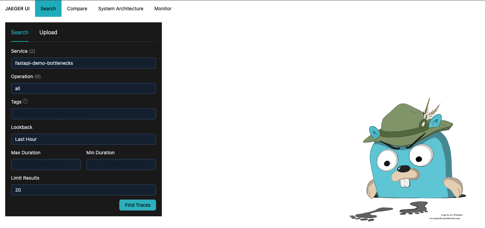
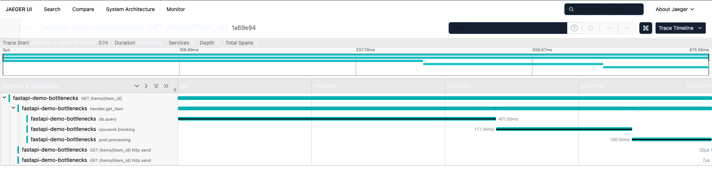
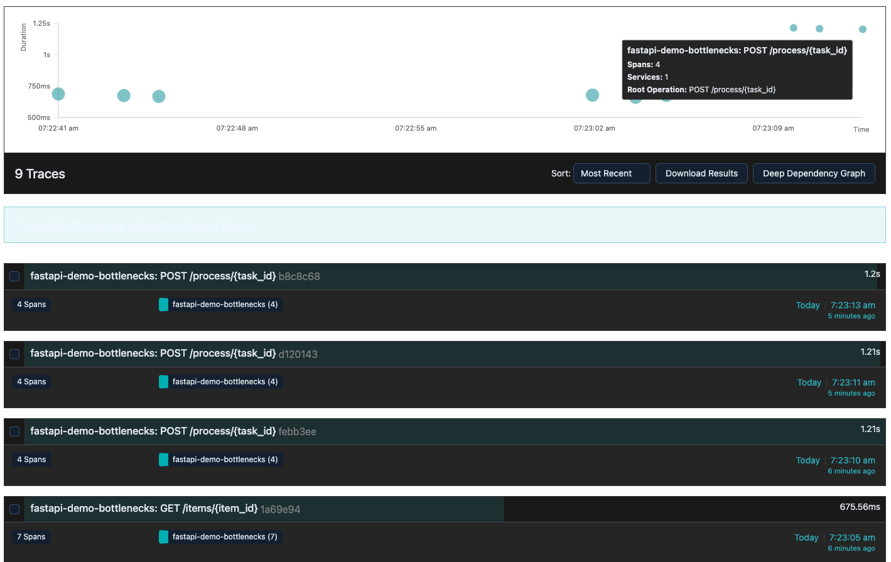
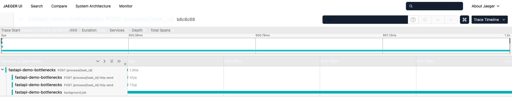
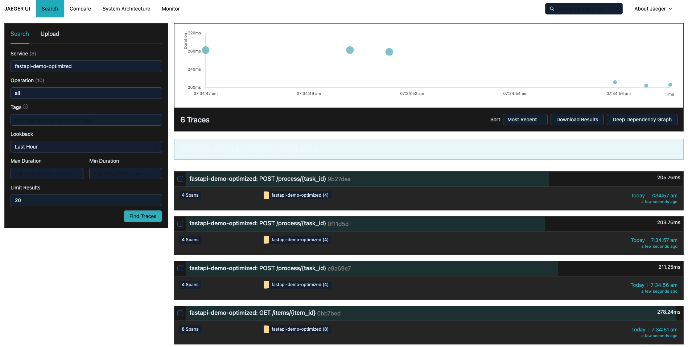
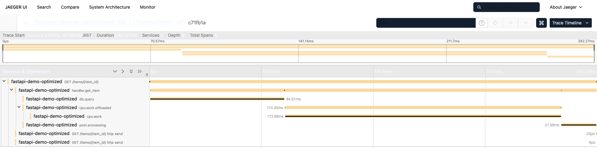
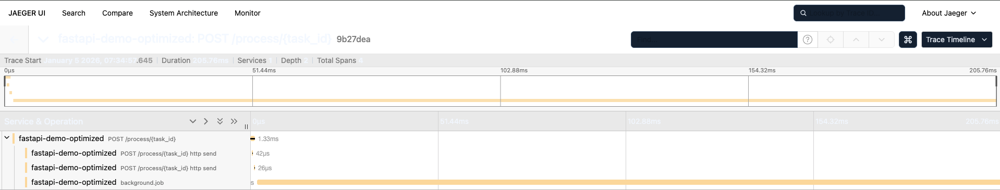

# Instrumenting Tracing In Your Application Isn't Optional

## Finding Bottlenecks In FastAPI with OTEL/Jaeger

Writing applications is something we're all familiar with.
We write the code, we test it out, and we ship it.
Code usually performs much differently in production environments
than in our local environments.

For example:

- Our local disk might be faster than the deployed environment
  (maybe deployed uses NFS).
- Our service might communicate with our database over
  `localhost` locally, so we might see network lag
  in deployed environments.
- The deployed system might have constraints on CPU/memory/bandwidth.
- etc.

These variations usually compound into performance problems.
What tends to happen is that tracing is put on the back-burner and
we're forced to resort to more difficult methods to find the bottlenecks.
Tracing makes these transparent so you can see exactly where the hot code
paths are.
Another unfortunate truth is that users tend to notice lag before anyone else.
We can expand tracing to include other metrics (observability!) so we can
alert when things like P99 get too high.

In this post, we're going to try to expand upon the above by:

- Explaining why tracing and metrics matter
- Introducing OpenTelemetry and why it has become the standard
- Instrumenting a FastAPI service locally
- Adding async and background task observability
- Introducing an artificial bottleneck
- Using telemetry to identify and fix performance issues

## Why Logs Aren’t Enough

Logs are great and they're an essential part of our observability stack.
Logs answer questions like:

- Did something fail?
- What exception occurred?

They do not answer:

- Where did this request spend time?
- Which dependency slowed it down?
- Why did p95 latency spike without errors?

To answer these questions, modern systems rely on the
three pillars of observability (Metrics, Logs, and Traces).

### Metrics

Metrics provide aggregated insight over time:

- Request latency (p50 / p95 / p99)
- Throughput
- Error rates
- Background job duration

Metrics can be used as time-series data to show, numerically, that an
application is unhealthy or degrading.

### Logs

Logs provide contextual detail and become dramatically
more useful when correlated with trace and span IDs.

### Traces

Traces show the full lifecycle of a request across services and functions.
Each trace is composed of spans, representing units of work such as
HTTP handlers, database calls, or background tasks.

## What Is OpenTelemetry?

[OpenTelemetry (OTel)](https://opentelemetry.io/)
is an open, vendor‑neutral set of APIs and tools for collecting:

- Traces
- Metrics
- Logs

It provides:

- Language‑specific SDKs (Python, Go, Java, JavaScript, etc.)
- Auto‑instrumentation for popular frameworks
- Portable exporters for tools like Jaeger, Tempo, Datadog, and Honeycomb

For FastAPI, OpenTelemetry can be used to instrument:

- Automatic request tracing
- Async‑safe context propagation
- Manual spans for fine‑grained insight

We're going to use OpenTelemetry with
[Jaeger](https://www.jaegertracing.io/)
to find an artificial bottleneck in our application.
The principles can apply to really any real-world application and
OTel works with tons of monitoring applications such as:

1. [GCP](https://docs.cloud.google.com/stackdriver/docs/managed-prometheus/setup-otel)

1. [AWS](https://docs.aws.amazon.com/AmazonCloudWatch/latest/monitoring/CloudWatch-OpenTelemetry-Sections.html)

1. [Thanos](https://thanos.io/tip/thanos/tracing.md/#opentelemetry-otlp)

## Project Setup / Prerequisites

In this project, we will be deploying a FastAPI application to kubernetes.
To automate this process, we will be using
[skaffold](https://skaffold.dev/)
and
[minikube](https://minikube.sigs.k8s.io/docs/).
The full list of dependencies are:

1. [Poetry](https://python-poetry.org/docs/)
   or another virtual environment

1. [Docker](https://www.docker.com/)

1. [Skaffold](https://skaffold.dev/)

1. [Minikube](https://minikube.sigs.k8s.io/docs/)

## Instrumenting a Slow FastAPI Service

Let's first look install our python dependencies and then look at our slow python
code.
To install dependencies:

```shell
poetry install --no-root
```

This will install all of the FastAPI, OTEL, and metrics libraries.
After installing the OpenTelemetry SDK and FastAPI instrumentation,
we can configure a tracer provider and attach it to the application.

```python

import asyncio
import time
import os
from fastapi import BackgroundTasks, FastAPI
from prometheus_client import make_asgi_app

from opentelemetry import metrics, trace
from opentelemetry.exporter.otlp.proto.http.trace_exporter import OTLPSpanExporter
from opentelemetry.exporter.prometheus import PrometheusMetricReader
from opentelemetry.instrumentation.fastapi import FastAPIInstrumentor
from opentelemetry.sdk.metrics import MeterProvider
from opentelemetry.sdk.resources import Resource
from opentelemetry.sdk.trace import TracerProvider
from opentelemetry.sdk.trace.export import BatchSpanProcessor
import uvicorn


RESOURCE = Resource.create({"service.name": "fastapi-demo-bottlenecks"})

trace_provider = TracerProvider(resource=RESOURCE)
otlp_traces_endpoint = os.getenv(
    "OTEL_EXPORTER_OTLP_TRACES_ENDPOINT",
    "http://jaeger:4318/v1/traces",
)

trace_exporter = OTLPSpanExporter(endpoint=otlp_traces_endpoint)
trace_provider.add_span_processor(BatchSpanProcessor(trace_exporter))
trace.set_tracer_provider(trace_provider)
tracer = trace.get_tracer(__name__)

metric_reader = PrometheusMetricReader()
meter_provider = MeterProvider(resource=RESOURCE, metric_readers=[metric_reader])
metrics.set_meter_provider(meter_provider)
meter = metrics.get_meter(__name__)

request_latency_ms = meter.create_histogram(
    name="http.server.request_duration",
    unit="ms",
    description="End-to-end request duration measured in handler",
)

bg_job_duration_ms = meter.create_histogram(
    name="background.job.duration",
    unit="ms",
    description="Background job duration",
)
```

The above instantiates a few pieces of monitoring infrastructure:

1. `Resource` – A `Resource` is an entity that will produce telemetry.
    This could be a service, API, background worker, or even a library.
    It defines what is emitting traces and metrics and provides identifying
    attributes such as the service name, version, and environment.
    All telemetry emitted by the application is automatically associated with
    this resource.

1. `TracerProvider` – A `TracerProvider` is responsible for creating and
    configuring tracers.
    It defines how traces are generated, what metadata is attached to them
    (via the Resource), and how spans are processed before export.
    Typically, a single `TracerProvider` is configured per application process.

1. `OTLPSpanExporter` – An `OTLPSpanExporter` is responsible for exporting spans
    out of the application using the OpenTelemetry Protocol (OTLP).
    It sends trace data to a collector or backend such as Jaeger, Tempo, or a
    managed observability platform.
    Using OTLP keeps the application vendor-neutral and portable.

1. `PrometheusMetricReader` – A `PrometheusMetricReader` exposes metrics in a
    Prometheus-compatible format so they can be scraped over HTTP.
    Rather than pushing metrics, it allows Prometheus to periodically pull
    aggregated metric data from the application.
    This enables alerting and visualization through tools like Prometheus and
    Grafana.

1. `MeterProvider` – A `MeterProvider` is the metrics counterpart to a
    `TracerProvider`.
    It is responsible for creating meters, registering metric readers, and
    managing how metrics are aggregated and exported.
    All metrics emitted by the application flow through the configured
    `MeterProvider` and share the same Resource metadata.

These will begin to form the backbone of the monitoring utilities.
We can now add spans to traces, trace specific endpoints or functions, and
emit metrics accordingly.

Now we can add the instrumentation to our application:

```python
app = FastAPI(title="FastAPI OTel Demo (Bottlenecks)")
FastAPIInstrumentor.instrument_app(app)

app.mount("/metrics", make_asgi_app())
```

The above will create a new FastAPI application, add the OTel auto-instrumentation
to it, and then expose a `/metrics` endpoint that something like Prometheus could scrape.
Once instrumented, every incoming request automatically emits a trace.
From there, we can add custom spans inside application code to observe
specific behavior such as database access, CPU work, or external calls.

Let's add a few extra routes to expose our API:

```python
@app.get("/items/{item_id}")
async def get_item(item_id: int) -> dict:
    start = time.time()

    with tracer.start_as_current_span("handler.get_item") as span:
        span.set_attribute("item.id", item_id)

        await slow_db_call_async()

        # INTENTIONALLY BAD: blocking CPU work in async handler
        _ = cpu_heavy_blocking_work()

        # A little extra async wait to create mixed async timing in trace
        with tracer.start_as_current_span("post.processing"):
            await asyncio.sleep(0.1)

    duration_ms = (time.time() - start) * 1000.0
    request_latency_ms.record(duration_ms, attributes={"route": "/items/{item_id}"})
    return {"item_id": item_id, "status": "ok", "mode": "bottlenecks"}


@app.post("/process/{task_id}")
async def process(task_id: str, background_tasks: BackgroundTasks) -> dict:
    # Kick off slow background work
    background_tasks.add_task(slow_background_job, task_id)
    return {"status": "queued", "task_id": task_id, "mode": "bottlenecks"}
```

We can see we have two routes:

1. GET `/items/{item_id}` which can simulate getting some ID from a database.

1. POST `/process/{task_id}` which can simulate the processing of some
   background task.


We can see that, to add manual spacs, all we have to do is use the
`start_as_current_span` context manager.
This makes adding spans extremely easily and they will automatically
close when the scope exits.


## Running OpenTelemetry Locally

Before running our application, let's introduce
[Jaeger](https://www.jaegertracing.io/).
`Jaeger` is a collector that we can run locally to export traces via the
OTLP protocol and visualize them immediately.
This allows developers to observe real request behavior during development,
not just in production.

We will use `skaffold` to automatically deploy `jaeger` and won't be going
through the K8s manifests.
If you're interested, please see the
[GitHub repo](https://github.com/afoley587/medium-posts-2026/tree/main/metrics/fastapi-otel/k8s).

## Finding the Bottleneck

Let's run our system locally to see if we can find the bottlenecks
in our application.

First, let's start a `minikube` cluster:

```shell
minikube start
```

And then let's run our `skaffold` stack:

```shell
skaffold dev
```

`skaffold` is configured to port forward a few services so that
you can interact with them locally:

1. `localhost:16686` - The `jaeger` UI

1. `localhost:8000` - The slow version of the API

1. `localhost:8001` - The fast version of the API

We can verify that everything is running with `kubectl`

```shell
% kubectl get pod
NAME                            READY   STATUS    RESTARTS   AGE
fastapi-fast-8656fb6785-fc5bt   1/1     Running   0          6s
fastapi-slow-6cccd7d948-m4428   1/1     Running   0          6s
jaeger-5475b45b88-dkh7k         1/1     Running   0          6s
```

We see that we have the fast version of the API (ignore for now),
the slow version of the API, and `jaeger`.

Let's simulate some requests to our slow API and generate a few spans:

```shell
$ curl http://localhost:8000/items/1
{"item_id":1,"status":"ok","mode":"bottlenecks"}
$ curl http://localhost:8000/items/1
{"item_id":1,"status":"ok","mode":"bottlenecks"}
$ curl http://localhost:8000/items/1
{"item_id":1,"status":"ok","mode":"bottlenecks"}
$ curl -X POST http://localhost:8000/process/abc
{"status":"queued","task_id":"abc","mode":"bottlenecks"}
$ curl -X POST http://localhost:8000/process/abc
{"status":"queued","task_id":"abc","mode":"bottlenecks"}
$ curl -X POST http://localhost:8000/process/abc
{"status":"queued","task_id":"abc","mode":"bottlenecks"}
```

Let's now go to http://localhost:16686 to see where the bottlenecks are.






We can see that our `db.query` span is taking `401ms`,
`cpu.work.blocking` is taking `171ms`,
and `post.processing` is taking `100ms`!

We can then correlate these spans to our code to find the bottlenecks:

```python
async def slow_db_call_async() -> None:
    with tracer.start_as_current_span("db.query"):
        # Simulate a slow dependency
        await asyncio.sleep(0.4)

def cpu_heavy_blocking_work() -> int:
    """
    INTENTIONALLY BAD:
    This runs CPU-bound work on the event loop thread (blocking).
    """
    with tracer.start_as_current_span("cpu.work.blocking"):
        total = 0
        # A big loop that will block the event loop.
        for i in range(7_000_000):
            total += i
        return total
```

We can see that we have some artificial sleeps in here and some event-loop blocking functionality.

We can also take a look at one of our background tasks.





We're spending `1.2s` on each background task!
Let's see the code for that:

```python
def slow_background_job(task_id: str) -> None:
    start = time.time()
    with tracer.start_as_current_span("background.job") as span:
        span.set_attribute("task.id", task_id)
        # Simulate slow background work
        time.sleep(1.2)

    duration_ms = (time.time() - start) * 1000.0
    bg_job_duration_ms.record(duration_ms, attributes={"task.type": "slow"})
```

Again, we are artificially sleeping, but imagine this is some large event-blocking or
non-optimized function call that we just found.

We can also go to http://localhost:8000/metrics/ and you'll see all of the
prometheus-formatted metrics for our application.

## Fixing the Bottlenecks

We've identified a few bottlenecks in our code.
We have some artificial sleeps and some sync code that blocks the event-loop.
We can perform some of the basic optimizations:

* Move CPU‑bound work off the event loop
* Reduce unnecessary computation
* Cache or speed up slow dependencies
* Shorten background job execution

Let's perform the same calls as we did to the slow application to see how the spans look:

```shell
$ curl http://localhost:8001/items/1
{"item_id":1,"status":"ok","mode":"optimized"}
$ curl http://localhost:8001/items/1
{"item_id":1,"status":"ok","mode":"optimized"}
$ curl http://localhost:8001/items/1
{"item_id":1,"status":"ok","mode":"optimized"}
$ curl -X POST http://localhost:8001/process/abc
{"status":"queued","task_id":"abc","mode":"optimized"}
$ curl -X POST http://localhost:8001/process/abc
{"status":"queued","task_id":"abc","mode":"optimized"}
$ curl -X POST http://localhost:8001/process/abc
{"status":"queued","task_id":"abc","mode":"optimized"}
$
```

We can see that our endpoints are responding in under 300ms, as opposed to the 750ms we did before.





Our background tasks are also finishing within 200ms, as opposed to 1.2 seconds.



## Concluding Thoughts

Tracing and metrics are so important to high-uptime systems.
These real systems typically perform so much differently in a deployed environment
(as opposed to our local environment).
These performance issues can negatively impact a customer's experience, even driving them
away from the application.
Unfortunately, without tracing, they notice the problems before us.
Adding metrics and tracing lets us get ahead of the problem, catch is before it happens
so we can manually intervene (scale up, add resources, etc.), and
fix the issue in the source code.


Until recently, adding tracing and metrics might have been really hard!
But, with OTEL, you can add minimal code and gain:

* End‑to‑end request tracing
* Aggregated latency metrics
* Async‑safe spans
* Background job observability
* Vendor‑neutral telemetry

I hope you enjoyed following along!
If you did, please clap for the story or follow me for other posts.
As always, you can find all of the relevant code on
[GitHub](https://github.com/afoley587/medium-posts-2026/tree/main/metrics/fastapi-otel).
