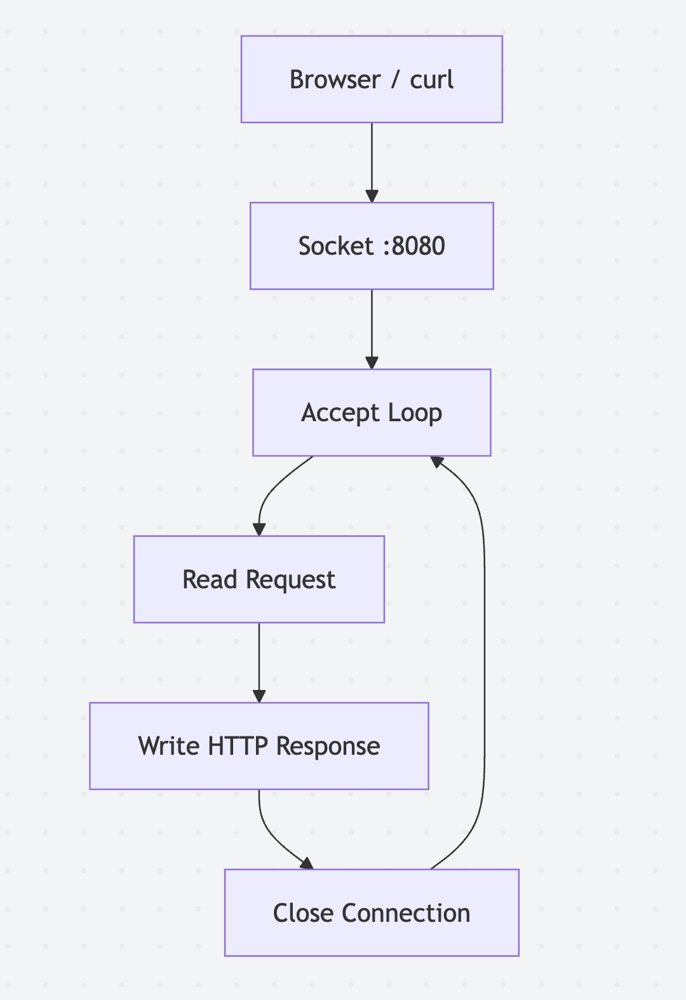
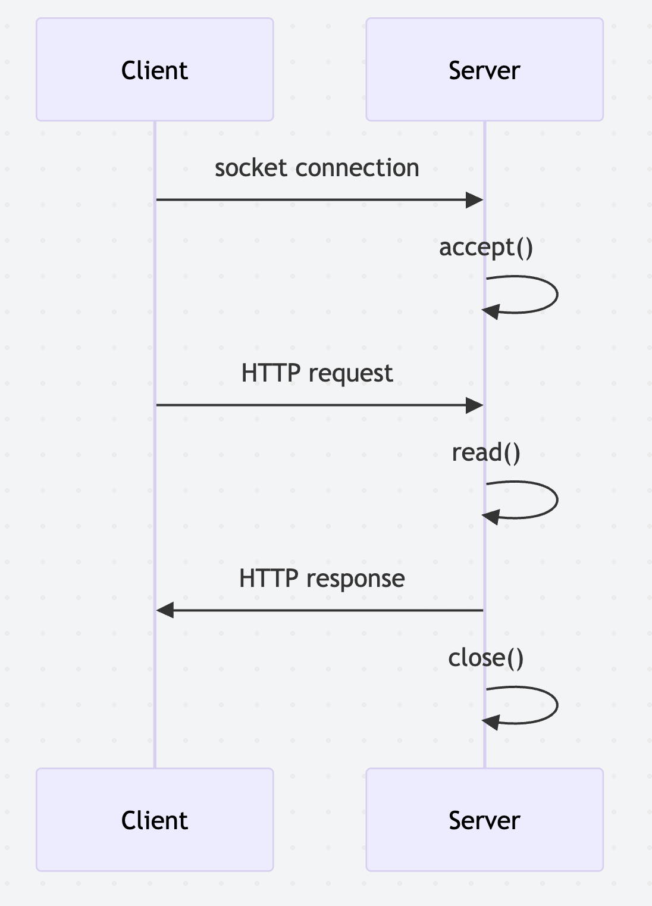

# Can You Build A REST API In Pure Assembly?

## Yes, but it's not pretty...

Most web frameworks feel pretty effortless today.
In Python, modern REST APIs can be so small that they barely look like a
server, we typically just use something like FastAPI and it's provided
decorators and we get a server, handlers, etc.:

```python
from fastapi import FastAPI

app = FastAPI()

@app.get("/health")
async def health():
    return {"ok": True}
```

That is one of the nice things about modern frameworks and it reduces
boiler plate code and cognitive overload by a massive percentage.
FastAPI, Flask, Express, Rails, Spring, Go's `net/http`, and more all let us
write our code in routes, handlers, middleware, request objects, 
response objects, JSON serialization, and deployment concerns while
underlying ideas are abstracted away from us and delegated to the framework.

Underneath the framework and convenience, a web server eventually becomes a 
socket, an accept loop, some bytes read from a connection, and some bytes 
written back.
At this point, HTTP is pretty well understood and always follows the same pattern:

- An HTTP (TCP) request arrives as bytes.
- The server does some work for you.
- An HTTP (TCP) response leaves as bytes.

But today we're curious about the lower levels, so what happens if we 
remove almost every abstraction?
In this post, we will build a tiny HTTP server entirely in ARM64 assembly for
Apple Silicon macOS.
It will listen on port `8080`, read an HTTP request, and return a fixed JSON
response:

```json
{"ok": true}
```

A few caveats for readers:

1. This runs on Apple Silicon (ARM64) and is not cross-platform
1. This is not a replacement for a production web framework.
1. Please do not deploy your next payments API as a handwritten assembly file
   unless your incident response team enjoys pages.

My goal was just to get deeper understanding of the systems I use.
I've built numerous applications in FastAPI, Flask, Gin, and more, but sometimes
it's fun to see what the frameworks provide for us.

## Building the Server

The server in this project is intentionally small:

- One endpoint-shaped response
- Plain HTTP only
- No TLS
- Single threaded
- One request at a time
- No routing framework
- No JSON library
- No middleware
- No dynamic allocation

It does not even parse the path.
You can request `/health`, `/`, `/anything`, or
`/why-is-this-written-in-assembly`, and it will return the same JSON body.
We're just going to focus on the core server lifecycle without getting 
distracted by routing, parsing, threads, queues, TLS certificates, 
or structured logging.

You're probably familiar with the basic server loops, which is what 
we'll be building in assembly:



The process creates a listening socket on port `8080`.
When a client connects, the server accepts that connection, reads the request
bytes into a buffer, writes a complete HTTP response, closes the client
connection, and goes back to waiting.

Almost every network server has some version of this shape.
Production servers add concurrency, buffering, protocol parsing, timeouts,
metrics, and error handling, but the heartbeat is still recognizable:

- wait for client connections
- receive the client
- process the request
- respond to client
- repeat

## Very Quick HTTP Primer

Before touching assembly, we need to remember what HTTP actually looks like.

An HTTP request is text sent over a TCP connection.
If you run:

```bash
curl http://localhost:8080/health
```

the request will look roughly like this:

```http
GET /health HTTP/1.1
Host: localhost:8080
User-Agent: curl/8.0
Accept: */*
```

The first line is the request line:

- `GET` is the method.
  It tells the server what kind of action the client is
  asking for.
- `/health` is the path.
  Frameworks usually route on this.
- `HTTP/1.1` is the protocol version.

The following lines are headers.
Headers are key-value metadata about the request.
They tell the server things like which host the client wanted, what kind of
client made the request, what formats the client accepts, whether the connection
should stay alive, and much more.

There is also usually a blank line after the headers.
For requests with a body, such as many `POST` requests, the body starts after
that blank line.

Responses have a similar shape:

```http
HTTP/1.1 200 OK
Content-Type: application/json
Content-Length: 13
Connection: close

{"ok": true}
```

The first line is the status line:

- `HTTP/1.1` is the protocol version.
- `200` is the status code.
- `OK` is the reason phrase.

Then come response headers:

- `Content-Type: application/json` tells the client the body is JSON.
- `Content-Length: 13` tells the client exactly how many bytes are in the body.
- `Connection: close` tells the client the server will close the TCP connection
  after sending the response.

Then there is a blank line, followed by the body:

```json
{"ok": true}
```

`Content-Length` matters because TCP is a stream of bytes.
It does not preserve convenient "response object" boundaries for us so
the client needs some way to know how much body data that it is expected 
to read.
In this server, the body is:

```text
{"ok": true}\n
```

That is 13 bytes including the trailing newline, which is why the response says
`Content-Length: 13`.

## The Server Lifecycle

Most high-level web frameworks hide the socket lifecycle, so 
we will go over a bit in this post so we can see what the
frameworks and operating systems do for us:



There are two sockets involved:

- The listening socket waits for new connections on port `8080`.
- The client socket represents one accepted connection from one client.

The listening socket does not handle the full conversation itself.
When a client connects, `accept()` gives us a new file descriptor for that
specific client conversation.
The server then reads from the client socket, writes the HTTP response to that
same client socket, closes it, and returns to the listening socket to wait for
the next visitor.

## The Same Server In Python

Before looking at assembly, here is the same idea in Python:

```python
import socket

server = socket.socket(socket.AF_INET, socket.SOCK_STREAM)
server.bind(("0.0.0.0", 8080))
server.listen(8)

while True:
    client, addr = server.accept()

    request = client.recv(1024)

    response = (
        b"HTTP/1.1 200 OK\r\n"
        b"Content-Type: application/json\r\n"
        b"Content-Length: 13\r\n"
        b"Connection: close\r\n"
        b"\r\n"
        b'{"ok": true}\n'
    )

    client.send(response)
    client.close()
```

This is already much closer to what we are building
than using a framework such as FastAPI.

The important calls are:

- `socket()` creates an endpoint for network communication.
- `bind()` attaches it to an IP address and port.
- `listen()` marks it as a passive socket that can accept incoming connections.
- `accept()` waits for a client and returns a new client socket.
- `recv()` reads bytes from that client socket.
- `send()` writes bytes back.
- `close()` ends the client connection.

The assembly server does the same thing, but it does so using
registers, labels, and explicit memory addresses.

## A Tiny ARM64 Assembly Primer

If you mostly write high-level languages, assembly can look like a different
species of programming.
But for this server, we only need a few ideas.

ARM64 has general-purpose registers named:

```text
x0-x30
```

A register is a small storage location directly inside the CPU.
Instead of saying "call `socket` with these arguments" as a high-level language
expression, we put arguments into the registers where the platform calling
convention expects them.

On Apple Silicon macOS:

- `x0` through `x7` are commonly used for function arguments.
- `x0` is also used for return values.
- `x16` holds the Darwin syscall number when entering the kernel directly.
- `x29` is the frame pointer.
- `x30` is the link register, which stores return addresses for function calls.
- `sp` is the stack pointer.

For example:

```asm
mov x0, #2
mov x1, #1
mov x2, #0
mov x16, #97
svc #0x80
```

This means:

```c
socket(AF_INET, SOCK_STREAM, 0)
```

The constants are:

- `2` for `AF_INET`, meaning IPv4.
- `1` for `SOCK_STREAM`, meaning TCP.
- `0` for the default protocol.
- `97` for Darwin's `SYS_socket` syscall number.

The instruction `svc #0x80` enters the kernel.
Instead of branching to the C library's `_socket` wrapper, we put the syscall
number in `x16` and trap directly into Darwin.
When the kernel returns, the return value is in `x0`.

If the syscall fails, Darwin sets the carry flag and leaves the error number in
`x0`.
The server checks that with `b.cs`, which means "branch if carry set."
If successful, the return value is a file descriptor.

## Walking Through The Server

Now we can read the assembly in pieces.

### Program Entry

The file starts by exporting `_main`, then setting up a small stack frame:

```asm
.equ SYS_exit,   1
.equ SYS_read,   3
.equ SYS_write,  4
.equ SYS_close,  6
.equ SYS_accept, 30
.equ SYS_socket, 97
.equ SYS_bind,   104
.equ SYS_listen, 106

.global _main
.align 2

_main:
    stp x29, x30, [sp, #-16]!
    mov x29, sp
```

macOS expects C-style symbols with a leading underscore, so the entry point is
`_main`, not `main`.

The `stp` instruction stores a pair of registers on the stack.
Here we save the old frame pointer and link register and
then we set `x29` to the current stack pointer so the function has a
conventional frame.

This keeps us aligned with the platform ABI and makes the program a better
citizen when linked normally with `clang`.

As a side note, our server does not call libc socket functions,
it still uses a normal Mach-O entry point, but the networking operations below
enter the kernel through Darwin syscalls.

### Socket Creation

The first real task to perform is to create a TCP socket:

```asm
// socket(AF_INET, SOCK_STREAM, 0)
mov x0, #2
mov x1, #1
mov x2, #0
mov x16, #SYS_socket
svc #0x80
b.cs _exit_error
mov x19, x0
```

This is the assembly equivalent of:

```c
int fd = socket(AF_INET, SOCK_STREAM, 0);
```

The arguments go into `x0`, `x1`, and `x2`.
The return value comes back in `x0`.
We copy it into `x19` because we need to keep the listening socket around for
the lifetime of the program.

In the ARM64 calling convention, `x19` is callee-saved.
Syscalls preserve it for our purposes here, and libc calls are expected to
preserve it too.
That makes it a good place to keep long-lived state like the listening socket
file descriptor.

The `b.cs _exit_error` line is a small error check.
If `socket` fails, the carry flag is set, and the program exits through a raw
`SYS_exit` syscall.

### Binding To Port 8080

Creating a socket gives us an endpoint, but it is not listening anywhere yet.
We need to bind it to an address and port:

```asm
// bind(fd, &addr, 16)
mov x0, x19
adrp x1, _addr@PAGE
add  x1, x1, _addr@PAGEOFF
mov x2, #16
mov x16, #SYS_bind
svc #0x80
b.cs _exit_error
```

This maps to:

```c
bind(fd, &addr, 16);
```

The first argument is the socket file descriptor.
The second is a pointer to a socket address structure.
The third is the size of that structure.

The address structure is hand-built in the data section:

```asm
_addr:
    .byte 16
    .byte 2
    .byte 0x1f, 0x90
    .long 0
    .zero 8
```

On macOS, IPv4 sockets use a `sockaddr_in` structure that starts with a length
byte:

| Bytes | Field | Meaning |
| --- | --- | --- |
| `16` | `sin_len` | The structure is 16 bytes long |
| `2` | `sin_family` | `AF_INET`, meaning IPv4 |
| `0x1f, 0x90` | `sin_port` | Port `8080` in network byte order |
| `0` | `sin_addr` | `0.0.0.0`, meaning all interfaces |
| eight zero bytes | `sin_zero` | Padding |

Port `8080` is decimal which is `0x1f90` in hex.
Network byte order is big-endian, so the bytes are written as `0x1f, 0x90`.

The `adrp` and `add` pair is a common ARM64 pattern for loading the address of a
label:

```asm
adrp x1, _addr@PAGE
add  x1, x1, _addr@PAGEOFF
```

`adrp` gets the memory page containing `_addr` and then
`add` adds the offset within that page.
After both instructions, `x1` points at `_addr`.

### Listening

Once the socket is bound, we tell the OS it should accept incoming connections:

```asm
// listen(fd, 8)
mov x0, x19
mov x1, #8
mov x16, #SYS_listen
svc #0x80
b.cs _exit_error
```

This maps to:

```c
listen(fd, 8);
```

The second argument is the backlog.
A backlog of `8` means the kernel may queue a small number of pending
connections while the server is busy.
This does not make the server concurrent but it does
give the operating system a little room to hold connection attempts
until our process calls `accept()`.

### The Accept Loop

Now we reach the main loop:

```asm
_accept_loop:
    // client = accept(fd, NULL, NULL)
    mov x0, x19
    mov x1, #0
    mov x2, #0
    mov x16, #SYS_accept
    svc #0x80
    b.cs _exit_error
    mov x20, x0
```

`accept()` blocks until a client connects.
When it returns, `x0` contains a new file descriptor for the client socket and
we save that in `x20`.

We pass `NULL` for the client address and address length because this demo does
not care who connected.
A real server might record the client IP for logs, metrics, rate limiting, or
access control.

The label `_accept_loop` is where the server returns after each request:

```asm
b _accept_loop
```

That unconditional branch is our `while True`.

### Reading Request Data

Once a client is connected, we read from it:

```asm
// read(client, buffer, 1024)
mov x0, x20
adrp x1, _buffer@PAGE
add  x1, x1, _buffer@PAGEOFF
mov x2, #1024
mov x16, #SYS_read
svc #0x80
b.cs _close_client
```

This maps to:

```c
read(client, buffer, 1024);
```

The buffer is reserved in the `.bss` section:

```asm
.bss
_buffer:
    .space 1024
```

`.bss` is for zero-initialized storage.
The executable does not need to store 1024 literal zero bytes on disk; it just
records that the program needs that much zeroed memory at runtime.

This server ignores the request contents.
It reads them so the client can send a normal HTTP request, but it does not
parse the method, path, headers, or body which is why every path returns 
the same response.

### Writing The HTTP Response

The response is stored as ASCII bytes:

```asm
_response:
    .ascii "HTTP/1.1 200 OK\r\n"
    .ascii "Content-Type: application/json\r\n"
    .ascii "Content-Length: 13\r\n"
    .ascii "Connection: close\r\n"
    .ascii "\r\n"
    .ascii "{\"ok\": true}\n"
_response_end:
```

This should be the exact byte sequence we want to send over the socket.
The code that writes it looks like this:

```asm
// write(client, response, response_len)
mov x0, x20

adrp x1, _response@PAGE
add  x1, x1, _response@PAGEOFF

adrp x2, _response_end@PAGE
add  x2, x2, _response_end@PAGEOFF
sub  x2, x2, x1

mov x16, #SYS_write
svc #0x80
```

The arguments are:

- `x0`: client socket file descriptor
- `x1`: address of the response bytes
- `x2`: number of bytes to write

Instead of hardcoding the total response length, the program calculates it:

```asm
sub x2, x2, x1
```

At that moment, `x1` points to `_response`, and `x2` points to `_response_end`.
Subtracting them gives the number of bytes between the two labels.

This is a nice assembly trick because it lets us edit headers or the body
without manually recounting the entire response length used by `write()`.

Important detail: this is different from the HTTP `Content-Length` header.
The `write()` length is the size of the entire HTTP response, including status
line, headers, blank line, and body.
`Content-Length` is only the size of the body.

### Closing The Client Connection

After the response is written, the server closes the accepted client socket:

```asm
// close(client)
_close_client:
mov x0, x20
mov x16, #SYS_close
svc #0x80

b _accept_loop
```

The listening socket in `x19` stays open.
Only the per-client socket in `x20` is closed.

Because the response includes:

```http
Connection: close
```

this behavior is also part of the protocol contract.
We are telling the client that the server will close the connection after this
response.

Then the process jumps back to `_accept_loop` and waits again.

## Running It

We can build the server with `clang`:

```bash
clang -arch arm64 server.s -o tiny-server
```

This build still produces a normal macOS Mach-O executable.
The program is linked in the usual way, but the server path does not call
`_socket`, `_bind`, `_listen`, `_accept`, `_read`, `_write`, or `_close`.
Those operations are raw Darwin syscalls.

Run it:

```bash
./tiny-server
```

In another terminal, test it with `curl`:

```bash
curl http://localhost:8080/health
```

Expected output:

```json
{"ok": true}
```

If you want to see the headers too:

```bash
curl -i http://localhost:8080/health
```

You should see something like:

```http
HTTP/1.1 200 OK
Content-Type: application/json
Content-Length: 13
Connection: close

{"ok": true}
```

The repository also includes a small `Makefile`, so you can use:

```bash
make build
make run
make curl
```

## Conclusion

Our web server was very small, but it's fun to see
what all of our frameworks do for us.
This example doesn't even worry about:

- Concurrency
- Routing
- Request parsing
- HTTP keep-alive
- TLS
- Chunked transfer encoding
- Dynamic memory allocation
- HTTP/2
- Backpressure handling
- Timeouts
- Partial write handling
- Error handling

This type of example makes me very thankful for the wonderful
open-source communities we have that build amazing libraries and
languages for us!

If you enjoyed this story, please clap, comment, or follow!
All code can be seen on my
[GitHub]()